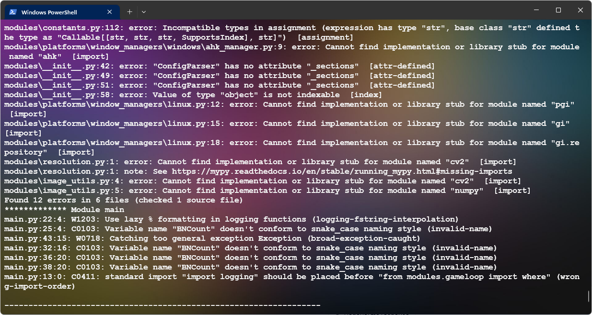

## Python Formatting and Linting Script

This PowerShell script automates the task of running several Python code formatting and linting tools on all Python files in the current directory and its subdirectories. The output of these tools is written to report_log_trimmed.txt after junk is removed. The script installs and uses the following Python libraries:

1. **Autoflake**: Autoflake removes unused imports and unused variables from Python code. It makes your code cleaner and helps reduce clutter. 
2. **Black**: This is an uncompromising Python code formatter. It takes care of all the stylistic decisions of your code so you can focus on the logic. It helps maintain a consistent style in your project and makes it easier for others to read and understand your code.
3. **Flake8**: Flake8 is a powerful tool that checks your Python code against some of the style conventions in PEP 8. It also includes PyFlakes, a tool for detecting various errors in Python code, and McCabe, a tool for measuring code complexity.
4. **MyPy**: This is a static type checker for Python. It combines the benefits of dynamic typing and static typing. As you write your code, MyPy ensures that it adheres to the type annotations you've set, catching common errors before runtime.
5. **Pylint**: Pylint is a highly configurable tool for performing static analysis of Python code. It checks for programming errors, helps enforce a coding standard, sniffs for code smells, and offers simple refactoring suggestions.
 

This combination of tools ensures that your Python code is well-formatted, follows Python's recommended style guide (PEP 8), is free from common programming errors, and is not cluttered with unused imports or variables. 

The script runs each of these libraries on every Python file, and collects the outputs in a text file. After all files have been processed, the script trims unnecessary output lines from the final report.

### autoflake:
- Switches used:
  - `--remove-all-unused-imports`
  - `--remove-unused-variables`
  - `--in-place`
- Switches available:
  - `--expand-star-imports`
  - `--expand-stubs`
  - `--exclude`
  - `--check`
  - `--check-untyped-defs`
  - `--check-unused-variables`
  - `--ignore-init-module-imports`
  - `--remove-unused-variables-ignore-private`
  - `--remove-unused-variables-recursive`
  - `--remove-unused-variables-verbose`
  - `--expand-star-imports`
  - `--ignore-init-module-imports`
  - `--remove-all-unused-imports`
  - `--remove-duplicate-keys`
  - `--remove-unused-variables`
  - `--remove-unused-variables-recursive`
  - `--remove-unused-variables-verbose`

### black:
- Switches used:
  - `--quiet`
- Switches available:
  - `--line-length`
  - `--target-version`
  - `--exclude`
  - `--include`
  - `--force-exclude`
  - `--check`
  - `--diff`
  - `--color`
  - `--fast`
  - `--skip-string-normalization`
  - `--extend-exclude`
  - `--extend-ignore`
  - `--config`

### flake8:
- Switches used: None
- Switches available:
  - `--exclude`
  - `--filename`
  - `--ignore`
  - `--select`
  - `--max-line-length`
  - `--max-complexity`
  - `--doctests`

### mypy:
- Switches used: None
- Switches available:
  - `--config-file`
  - `--exclude`
  - `--follow-imports`
  - `--follow-imports-forbid`
  - `--ignore-missing-imports`
  - `--implicit-reexport`
  - `--incremental`
  - `--no-implicit-optional`
  - `--no-warn-unused-ignores`
  - `--pretty`
  - `--show-column-numbers`
  - `--show-error-codes`
  - `--strict`
  - `--strict-optional`
  - `--warn-incomplete-stub`
  - `--warn-maybe-uninitialized`
  - `--warn-no-return`
  - `--warn-redundant-casts`
  - `--warn-unreachable`
  - `--warn-unused-configs`
  - `--warn-unused-ignores`

### pylint:
- Switches used: None
- Switches available:
  - `--disable`
  - `--enable`
  - `--ignore`
  - `--load-plugins`
  - `--msg-template`
  - `--reports`
  - `--disable-all`
  - `--enable=all`
  - `--score`
  - `--ignore-patterns`
  - `--ignore-comments`
  - `--max-line-length`
  - `--indent-string`
  - `--indent-after-parenthesis`
  - `--good-names`
  - `--bad-names`
  - `--variable-rgx`
  - `--attr-rgx`
  - `--argument-rgx`
  - `--function-rgx`
  - `--method-rgx`
  - `--module-rgx`
  - `--class-rgx`
  - `--const-rgx`
  - `--no-docstring-rgx`

## Bonus points

Feed the log by URL (github/pastebin) into ChatGPT4 with Bing search with a prompt and have it give you a list of fixes to make.

Don't mind that it labeled the code block vbnet, the rest was correct :satisfied:

## PY version coming shortly.
